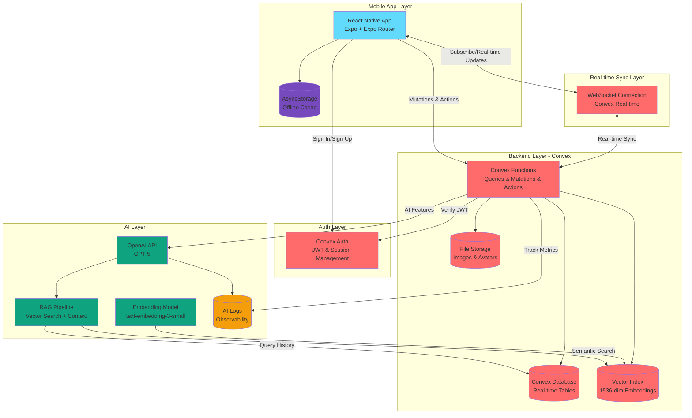

# Sun Chat

A production-quality real-time messaging application built for **Remote Team Professionals**, featuring AI-powered features to enhance team communication and productivity.

## Overview

Sun Chat is a cross-platform messaging app built with React Native and Expo, designed specifically for distributed teams. It combines robust real-time messaging infrastructure with intelligent AI features powered by OpenAI to help teams stay organized, extract insights from conversations, and make better decisions through semantic search and automated analysis.

## Features

### Core Messaging

- **Real-time Message Delivery**: Sub-200ms message delivery with Convex WebSocket-based real-time sync
- **Offline Support**: Full message persistence with AsyncStorage, messages queue and sync when reconnected
- **Group Chat**: Support for 3+ users with proper message attribution
- **Text & Image Messages**: Send both text and image messages in conversations
- **Online/Offline Presence**: Live presence indicators showing who's online
- **Typing Indicators**: Real-time typing status for all participants
- **Optimistic UI Updates**: Messages appear instantly before server confirmation
- **Message History**: Paginated message loading with "Load older" functionality
- **Room Management**: Create and manage direct and group conversations

### AI Features for Remote Teams

Fully implemented AI capabilities powered by OpenAI GPT-5:

1. **Thread Summarization** ✅
   - Generate concise 5-8 bullet point summaries of conversation threads
   - Perfect for catching up on long discussions
   - Stored and tracked per room

2. **Action Item Extraction** ✅
   - Automatically identify and extract actionable tasks from discussions
   - Extract assignees, due dates, and priorities when mentioned
   - JSON-structured output for easy integration

3. **Semantic Search with RAG** ✅
   - Ask questions about conversation history using natural language
   - Vector embeddings (text-embedding-3-small) for all messages
   - Retrieval-augmented generation for context-aware answers
   - Cosine similarity search across conversation history

4. **Priority Message Detection** ✅
   - AI classification of message priority: urgent, time-sensitive, blocker, or normal
   - Automatic flagging of important messages
   - Batch processing of recent messages

5. **Decision Tracking** ✅
   - AI-powered detection of decision points in conversations
   - Boolean flag for messages containing decisions
   - Searchable and filterable decision history

6. **AI Observability** ✅
   - Comprehensive logging of all AI operations
   - Token usage tracking (input/output)
   - Performance metrics (duration, model used)
   - Error tracking and status monitoring

## Tech Stack

### Frontend
- **React Native 0.81** - Cross-platform mobile framework
- **Expo 54** - Development and deployment platform  
- **Expo Router 6** - File-based routing for React Native
- **React 19** - Latest React with concurrent features
- **AsyncStorage** - Persistent key-value storage for offline support
- **Expo Image Picker** - Native image selection and upload

### Backend
- **Convex** - Real-time database with serverless functions
- **Convex Real-time Sync** - WebSocket-based real-time data synchronization
- **Convex Auth** - Built-in authentication with JWT validation
- **Convex File Storage** - Native file storage for images and avatars

### Authentication
- **@convex-dev/auth** - Convex's native authentication system
- Email/password authentication with JWT tokens
- Secure token storage with Expo Secure Store

### AI Integration
- **OpenAI GPT-5** - Fast, efficient language model for chat features
- **OpenAI text-embedding-3-small** - Vector embeddings for semantic search
- **Custom RAG Pipeline** - Retrieval-augmented generation with vector similarity
- **Convex Vector Index** - Native vector search with 1536-dimensional embeddings
- **AI Observability** - Comprehensive logging and metrics tracking

## Architecture



### Data Flow

1. **Message Sending**:
   - User types message → Typing indicator updates in real-time
   - Optimistic UI update → Store in AsyncStorage with tempId
   - Message sent to Convex via mutation → Stored in Convex DB
   - Real-time sync broadcasts to all participants via WebSocket
   - Message embedding generated asynchronously by AI pipeline
   - Participants receive message instantly with delivery confirmation

2. **Offline Handling**:
   - Messages saved to local AsyncStorage when offline with pending status
   - Outbox queue tracks pending messages with metadata
   - On reconnection, `useOfflineSync` hook automatically drains outbox
   - Pending messages sent in order with deduplication
   - Full chat history always available from local cache
   - Server messages merged with local cache on sync

3. **AI Features**:
   - User requests AI action (e.g., "Ask AI", "Summarize", "Extract Actions")
   - Request sent to Convex action with authentication and room context
   - For RAG queries:
     - User prompt is embedded using OpenAI embeddings API
     - Vector search finds top-k most similar messages (k=12 default)
     - Retrieved messages provide context to GPT-5
     - AI generates contextual response using conversation history
   - For summarization/action extraction:
     - Recent messages fetched (up to 300 for summaries, 200 for actions)
     - Formatted as conversation context
     - GPT-5 generates structured output (summary or JSON action items)
   - For message classification:
     - Individual messages analyzed for priority and decision flags
     - Batch processing available for recent messages
   - All AI operations logged with token usage, duration, and status
   - Results stored in database for future reference

## Database Schema

### Core Tables

- **users**: User profiles with auth userId (subject ID), email, display name, avatar (URL or storage ID)
- **rooms**: Chat rooms with name, isGroup flag, and creator reference
- **memberships**: Many-to-many relationship between users and rooms
- **messages**: Chat messages with room, sender, message kind (text/image), content, timestamps
- **presence**: Real-time presence and typing indicators per user per room

### AI & Search Tables

- **messageEmbeddings**: Vector embeddings (1536-dim) for each message with Convex vector index
- **aiLogs**: Comprehensive logging for all AI operations (answer, summarize, action_items, search, classify)
  - Tracks model, duration, token usage (input/output), status, and errors
- **threadSummaries**: Cached summaries of conversation threads per room
- **actionItems**: Extracted action items with optional assignee, due date, and priority
- **aiSignals**: Message-level AI signals (isDecision flag, priority classification)
- **aiStreams**: Support for streaming AI responses
- **aiStreamEvents**: Individual token events for streaming responses

### Auth Tables

- **authTables**: Convex Auth tables for session and token management (automatically managed)

## Prerequisites

- **Node.js** (v18 or higher)
- **npm** or **yarn**
- **Expo CLI**: `npm install -g expo-cli` (optional, can use npx)
- **Convex Account**: Sign up at [convex.dev](https://convex.dev)
- **OpenAI API Key**: Required for AI features (get from [platform.openai.com](https://platform.openai.com))
- **Android Studio** or **Xcode** (for native builds, optional)

## Installation

1. **Clone the repository**:
```bash
git clone https://github.com/yourusername/sun-chat.git
cd sun-chat
```

2. **Install dependencies**:
```bash
npm install
```

3. **Set up Convex**:
```bash
npx convex dev
```
This will:
- Create a new Convex project (or link to existing)
- Generate your `CONVEX_URL` automatically
- Push the database schema from `convex/schema.ts`
- Start the Convex development server with hot reload

4. **Configure environment variables**:

The Convex deployment will automatically set `CONVEX_URL` for you. You only need to add your OpenAI API key to the Convex dashboard:

**In Convex Dashboard** (https://dashboard.convex.dev):
- Navigate to your project → Settings → Environment Variables
- Add: `OPENAI_API_KEY=sk-xxxxx`

**For local development**, optionally create `.env.local`:
```env
# Convex URL is auto-generated, but you can override:
# EXPO_PUBLIC_CONVEX_URL=https://your-deployment.convex.cloud

# OpenAI API Key (required for AI features)
OPENAI_API_KEY=sk-xxxxx
```

5. **Verify setup**:
```bash
# Check that Convex is running
npx convex dev

# In another terminal, verify OpenAI integration
curl https://your-deployment.convex.cloud/ai/info
```

## Running the App

### Development Mode

1. **Start Convex development server** (in one terminal):
```bash
npx convex dev
# or
npm run convex:dev
```

2. **Start Expo development server** (in another terminal):
```bash
npx expo start
# or
npm start
```

3. **Run on your device**:
- Press `i` for iOS simulator (requires Xcode)
- Press `a` for Android emulator (requires Android Studio)
- Press `w` for web browser (limited native features)
- Scan the QR code with Expo Go app (iOS/Android) for physical device testing

### Running on Physical Devices

**iOS (via Expo Go)**:
1. Install Expo Go from the App Store
2. Ensure your device and computer are on the same network
3. Scan the QR code from the terminal with your Camera app
4. App will open in Expo Go

**Android (via Expo Go)**:
1. Install Expo Go from Google Play Store
2. Ensure your device and computer are on the same network
3. Scan the QR code from the terminal within the Expo Go app
4. App will load on your device

**Development Build (Native)**:
For a more production-like experience with custom native code:
```bash
# iOS
npx expo run:ios

# Android
npx expo run:android
```

## Deployment

### Production Deployment

**Backend (Convex)**:
```bash
# Deploy to production
npx convex deploy

# Set production environment variables in dashboard
# - OPENAI_API_KEY
```

**Frontend (EAS Build)**:

This project uses EAS (Expo Application Services) for building and deployment:

```bash
# Install EAS CLI
npm install -g eas-cli

# Configure EAS
eas build:configure

# Build for iOS (requires Apple Developer account)
eas build --platform ios

# Build for Android
eas build --platform android

# Submit to stores
eas submit --platform ios
eas submit --platform android
```

**Preview/Internal Testing**:
```bash
# Build development client
eas build --profile development --platform android

# Create preview build
eas build --profile preview --platform all
```

## Project Structure

```
sun-chat/
├── app/                      # Expo Router app directory
│   ├── (tabs)/              # Tab navigation
│   │   ├── _layout.tsx      # Tab layout
│   │   └── chats/           
│   │       └── index.tsx    # Chats list + room creation
│   ├── chat/                
│   │   └── [roomId].tsx     # Chat room with messages + AI features
│   ├── _layout.tsx          # Root layout with Convex provider
│   └── index.tsx            # Auth screen (sign in/sign up)
├── convex/                   # Convex backend
│   ├── _generated/          # Auto-generated Convex types
│   ├── schema.ts            # Database schema (12 tables)
│   ├── auth.config.ts       # Convex Auth configuration
│   ├── auth.ts              # Authentication functions
│   ├── http.ts              # HTTP routes (auth + AI info)
│   ├── messages.ts          # Message queries/mutations
│   ├── rooms.ts             # Room management
│   ├── presence.ts          # Online/typing indicators
│   ├── users.ts             # User management
│   └── ai.ts                # AI features (500+ lines)
│       ├── embedText        # Generate embeddings
│       ├── answer           # RAG-based Q&A
│       ├── summarizeThread  # Thread summarization
│       ├── extractActionItems # Action item extraction
│       └── classifyMessageSignals # Priority/decision detection
├── hooks/
│   └── useOfflineSync.ts    # Offline message sync hook
├── lib/
│   └── offlineStorage.ts    # AsyncStorage wrapper for offline cache
├── types/
│   └── offline.ts           # TypeScript types for offline messages
├── android/                 # Native Android project
├── package.json             # Dependencies and scripts
├── app.json                 # Expo configuration
├── eas.json                 # EAS Build configuration
└── README.md               # This file
```

## Key Features Walkthrough

### Creating a Chat Room

1. Sign up or sign in on the landing screen
2. Navigate to the "Chats" tab (automatically shown after login)
3. Enter a room name in the text input
4. Select members from the user list (tap to toggle selection)
   - Selected members have colored background
   - Green indicator shows who's currently online
5. Tap "Create Room" to start chatting

### Sending Messages

1. Tap on a room to open the chat
2. Type your message in the bottom input field
3. Typing indicators appear in real-time when others are typing
4. Tap "Send" to deliver the message
5. Messages appear instantly with optimistic UI
6. Gray background = your message, white = others' messages
7. Load older messages by tapping "Load older messages" button

### Image Messages

1. In any chat room, tap "Pick Image" button
2. Select an image from your device
3. Enter an image URL in the modal, or tap "Pick from device"
4. Image uploads to Convex storage and appears in chat
5. Tap any image to view full-screen

### Offline Support

1. Go offline (airplane mode or no connection)
2. Send messages - they'll be queued with "[pending]" tag
3. Messages saved to AsyncStorage immediately
4. All chat history remains accessible
5. Go back online
6. Pending messages automatically sync via `useOfflineSync` hook
7. "[pending]" tags disappear when confirmed

### Using AI Features

**Ask AI (Semantic Search)**:
1. Tap "Ask AI" button in any chat
2. Enter your question (e.g., "What did we decide about the deadline?")
3. AI searches message embeddings for relevant context
4. Get contextual answers based on conversation history

**Summarize Thread**:
1. Tap "Summarize" button
2. AI generates 5-8 bullet points summarizing the conversation
3. Summary appears in a modal
4. Stored in database for future reference

**Extract Action Items**:
1. Tap "Extract Actions" button
2. AI identifies tasks, assignees, due dates, priorities
3. Structured JSON output displayed
4. Can be integrated with task management systems

**Insights Panel**:
- View all AI insights in the expandable "Insights" section
- See summaries, action items, and AI answers
- Collapsible UI keeps chat clean

## Testing Scenarios

The app has been tested for:

### Core Messaging
1. ✅ Real-time messaging between multiple devices
2. ✅ Text and image message sending
3. ✅ Typing indicators updating in real-time
4. ✅ Online/offline presence indicators
5. ✅ Message pagination with "Load older" functionality
6. ✅ Group chat with 3+ participants
7. ✅ Direct messaging (2 users)

### Offline & Sync
1. ✅ Offline message queuing with pending status
2. ✅ Automatic sync on reconnect
3. ✅ App backgrounding and foregrounding
4. ✅ Force quit and restart with data persistence
5. ✅ Poor network conditions and reconnection
6. ✅ Message deduplication on sync

### AI Features
1. ✅ Semantic search with RAG (vector embeddings)
2. ✅ Thread summarization
3. ✅ Action item extraction with structured output
4. ✅ Message classification (priority/decision)
5. ✅ AI logging and observability
6. ✅ Embedding generation for new messages

### Performance
1. ✅ Rapid-fire messaging (50+ messages)
2. ✅ Large conversation history (500+ messages)
3. ✅ Image upload and rendering
4. ✅ Smooth scrolling through history

## Troubleshooting

### Convex Connection Issues
- Ensure `npx convex dev` is running in a separate terminal
- Check console for `CONVEX_URL` - should be auto-injected
- Verify network connectivity
- Try clearing cache: `npx expo start -c`

### Authentication Issues
- Convex Auth uses email/password by default
- Check Convex dashboard for auth configuration
- Verify auth routes are exposed via `convex/http.ts`
- Clear app data and try signing up again

### AI Features Not Working
- Verify `OPENAI_API_KEY` is set in Convex dashboard
- Check API key has sufficient credits
- Test with: `curl https://your-deployment.convex.cloud/ai/info`
- Review AI logs in Convex dashboard (aiLogs table)

### Offline Sync Issues
- Check browser console for `[OfflineSync]` logs
- Verify AsyncStorage permissions
- Clear AsyncStorage: uninstall/reinstall app
- Ensure `useOfflineSync` hook is mounted

### App Not Loading
- Clear Expo cache: `npx expo start -c`
- Clear node_modules: `rm -rf node_modules && npm install`
- Clear Expo cache: `npx expo start --clear`
- Check for TypeScript errors: `npm run typecheck`
- Verify Convex deployment: `npx convex dashboard`

### Build Issues
- Android: Clear gradle cache in `android/` folder
- iOS: `cd ios && pod install` (if using bare workflow)
- EAS Build: Check build logs in EAS dashboard

## Performance

### Messaging
- Message delivery: **< 200ms** on good network (Convex WebSocket)
- App launch to chat: **< 2 seconds**
- Optimistic UI: messages appear **instantly**
- Offline message sync: **< 1 second** after reconnection
- Smooth 60 FPS scrolling through 500+ messages

### AI Operations
- Embedding generation: **~500ms** per message
- RAG search: **1-2 seconds** (embedding + vector search + LLM)
- Thread summarization: **2-4 seconds** (300 messages)
- Action extraction: **2-3 seconds** (200 messages)
- Message classification: **~800ms** per message

### Database
- Real-time updates: **< 100ms** latency
- Presence updates: Real-time via Convex subscriptions
- Vector search: **< 200ms** for 1000+ embeddings
- Query response: **< 50ms** for most queries

## API Reference

### Key Convex Functions

**Queries** (read data, reactive):
- `api.users.current` - Get current authenticated user
- `api.users.listAll` - List all users
- `api.rooms.listForCurrentUser` - Get user's rooms
- `api.messages.listByRoom` - Get messages (with pagination)
- `api.presence.listByRoom` - Get presence for room

**Mutations** (write data):
- `api.users.upsert` - Create/update user profile
- `api.rooms.create` - Create new room
- `api.messages.send` - Send message
- `api.presence.setPresence` - Update presence/typing

**Actions** (external APIs):
- `api.ai.answer` - RAG-based Q&A
- `api.ai.summarizeThread` - Summarize conversation
- `api.ai.extractActionItems` - Extract action items
- `api.ai.classifyMessageSignals` - Classify priority/decisions
- `api.ai.backfillEmbeddings` - Generate embeddings for existing messages

## Contributing

Contributions are welcome! This project was built as a production-quality chat application with AI features for remote teams.

### Development Guidelines
- Follow TypeScript best practices
- Use Convex schema for database changes
- Add proper error handling
- Log AI operations for observability
- Test offline functionality
- Maintain type safety

### Areas for Contribution
- Additional AI features (sentiment analysis, topic extraction)
- Enhanced UI/UX
- More comprehensive offline support
- Push notifications
- File attachments beyond images
- Voice messages
- E2E encryption

## License

MIT License - feel free to use this code for your own projects.

## Acknowledgments

Built with:
- [Convex](https://convex.dev) - Real-time backend platform and database
- [Convex Auth](https://labs.convex.dev/auth) - Authentication solution
- [Expo](https://expo.dev) - React Native development platform
- [OpenAI](https://openai.com) - GPT-5 and text-embedding-3-small
- [React Native](https://reactnative.dev) - Cross-platform mobile framework

## Learn More

- [Convex Documentation](https://docs.convex.dev)
- [Expo Documentation](https://docs.expo.dev)
- [React Native Documentation](https://reactnative.dev/docs/getting-started)
- [OpenAI API Documentation](https://platform.openai.com/docs)

---

**Built for Remote Team Professionals** 🌐

Making distributed team communication more productive and organized with AI-powered insights, semantic search, and intelligent conversation analysis.

